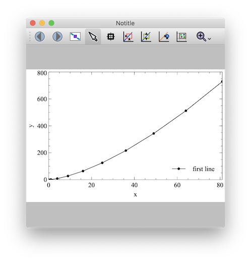

# 1. Plotter

- [1. Plotter](#1-plotter)
  - [1.1. Usage](#11-usage)
  - [1.2. Contribution](#12-contribution)
  - [License](#-license)


Minimalist plotter class for any purpose. Created for internal needs. Feel free to use it and contribute (see [contribution section](#12-contribution)).


## 1.1. Usage

```python
>>> from vplotter import Plotter
>>> p = Plotter()
===> [Plotter: (engine:veusz)] is initialized [v.X.Y.Z]
>>> p.plot(x=[i**2 for i in range(10)], y=[i**3 for i in range(10)], key_name="first line")

```

If you see something similar to this:



So you have it. Nice! 

Similarly you can use another engine: GnuplotEngine. 

```python
>>> from vplotter import Plotter
>>> p = Plotter(engine="gnuplot", xname="X", yname="Y", title="My Title")
===> [Plotter: (engine:gnuplot)] is initialized [v.1.3.0]
>>> p.plot(x=[i**2 for i in range(10)], y=[i**3 for i in range(10)], key_name="first line")
>>>

```
```
                                     My Title
     90 +------------------------------------------------------------------+
        |      +       +      +       +      +       +      +       +      |
     80 |-+                                             first line ********|
        |                                                               ** |
     70 |-+                                                           ** +-|
        |                                                          ***     |
     60 |-+                                                     ***      +-|
        |                                                     **           |
     50 |-+                                                ***           +-|
  Y  40 |-+                                            ****              +-|
        |                                          ****                    |
     30 |-+                                    ****                      +-|
        |                                   ***                            |
     20 |-+                             ****                             +-|
        |                         ******                                   |
     10 |-+                *******                                       +-|
        |      +   ********   +       +      +       +      +       +      |
      0 +------------------------------------------------------------------+
        0      1       2      3       4      5       6      7       8      9
                                         X
```

Currently GnuplotEngine is in experimental mode.
It is plotting the graph only to your terminal. Further releases would expand the functionality.

## 1.2. Contribution

Feel free to contribute to the project, but please initially create an issue with detailed problem and way how to resolve it. 

## License
----

MIT
